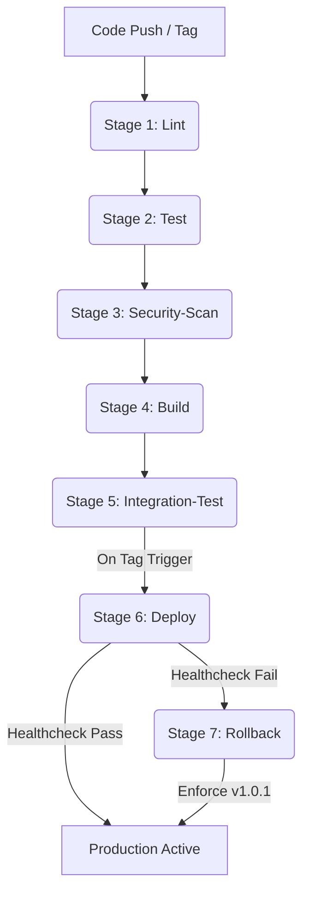

# edgeai-hw6 — Team Henry & Yanting Lin
*I4210 AI 實務專題, Tatung University*

[](https://github.com/henry1tsai/edgeai-hw6/actions/workflows/ci.yml)
[](https://github.com/henry1tsai/edgeai-hw6/releases)

---

## Operations

### Quickstart
```bash
git clone https://github.com/henry1tsai/edgeai-hw6.git
cd edgeai-hw6
pdm install -d
pdm run pytest tests/ --ignore=tests/integration
# Expected: 46 passed, coverage 99%
```

### How to Deploy a New Release
1. Ensure CI is green on `main`.
2. Tag a release: 
   ```bash
   git tag -a v1.0.0 -m "Release notes" && git push --tags
   ```
3. Go to **GitHub Actions** → **Deploy run** → **Review deployments** → **Approve and deploy**.
4. Monitor deployment status on the Jetson: 
   ```bash
   bash deploy/healthcheck.sh
   ```

### How to Roll Back
當全新版號（如 `v1.0.12`）推上雲端並經由 GitHub Environments 審核派發至邊緣端時，系統會自動在 A 機器本地的 `/var/lib/edgeai-hw6` 目錄下建立**狀態檔案對（State File Pair）**。

#### Symptoms checklist（何時需要 rollback）
* **FastAPI 服務中斷**：遠端/本地健康檢查輪詢時，高頻率連續出現 `Endpoint offline or warming up...`，代表伺服器因底層死結或初始化異常而未正常開啟 Port 8000。
* **推理主行程斷線 (Heartbeat Lag)**：`healthcheck.sh` 撈取 `/healthz` 端點雖有回應，但內部 YOLO 推理行程因環境、影片源掛載錯位、MQTT 斷線或推理解碼卡死，導致心跳檔案時間戳記超過過期門檻，畫面輸出 `streak broken at 2`。

#### 執行指令
在全自動 CD 管線中，`deploy.sh` 偵測到上述故障時會自動、無人值守地攜帶參數觸發回滾。若要在 A 機器本地手動執行並量測時耗，指令如下：

```bash
# 語法：bash deploy/rollback.sh <壞掉的版本> <確認穩定的舊版本>
time bash deploy/rollback.sh "v1.0.12" "v1.0.1"
```
*註：目前未能成功

#### Two-broken-tags recovery 處理方式
若不幸發生連續兩個 Tag（例如新發行的 `v1.0.11` 與 `v1.0.12`）皆因不可抗力故障，而持久化歷史檔案 `deployed.txt.history` 遭到破壞或版本互相踩踏時，`rollback.sh` 內建防禦性降級邏輯（File Auditing Fallback）：腳本會強制讀取本地持久化歷史檔案的最底列，或降級至系統設定的黃金基線版本（Baseline Master: `v1.0.1`）。

在極端狀態下，可由團隊成員透過管理通道強制向 A 機器複寫狀態檔案，將持久化控制面導正：
```bash
echo "v1.0.1" > /var/lib/edgeai-hw6/deployed.txt
```

#### 通知團隊的 Slack / email 範本
```plaintext
Subject: [CRITICAL ALERT] Edge AI Platform Auto-Rollback Triggered on Host-A

Attention Team,

The automated deployment pipeline has detected a critical healthcheck failure during the release candidate rollout. The system has activated the parameter-driven atomic rollback mechanism to safeguard edge operations.

- Identified Broken Version: v1.0.12
- Recovered Stable Version: v1.0.1 (Rollback SUCCESS, passed 3x consecutive audits)
- Root Cause: [FastAPI Endpoint Offline / Heartbeat Streak Broken at 2]
- Current Status: System safe, edge inference fully restored at v1.0.1.

Please review the live GitHub Actions log files and check the recorded artifacts at `evidence/rollback-demo.cast`. Do not push further tags until the local environment telemetry is audited.
```

---

## Architecture
本專案建構了一套高可靠度的邊緣端 CI/CD 自動化管線。以下為完整的管線架構與控制面生命週期流程圖：



### 1. Lint (ruff check)
本階段做為代碼風格的第一道防線，透過 `ruff` 對全案原始碼進行高效率的靜態分析與排版審查，強制要求縮排、變數宣告與排版符合作業規範，並在任何不合規語法進入管線前直接予以攔截。

### 2. Test (pytest + coverage gate ≥90% + accuracy gate)
執行 `pytest` 驅動單元測試，全案在不使用外部真實 Broker 的模擬狀態下對 `InferenceNode` 進行深度路徑覆蓋（Coverage $\ge 90\%$ Gate）。同時啟動 Snapshot 精度門檻審查，將本次 Calibration 產出的 mAP 數值與基線 JSON 進行自動化比對，確保 $\Delta\text{mAP} \le 2$ pts。

### 3. Security-Scan (bandit + pip-audit)
專注於供應鏈與代碼安全性防禦。利用 `bandit` 掃描 Python 原始碼是否有寫死的敏感資訊或弱加密行為，並同步調度 `pip-audit` 對 PDM 相依套件進行 CVE 漏洞掃描，確保零安全隱患。

### 4. Build (docker buildx QEMU ARM64 → GHCR)
當品質與安全雙重門檻通過後，利用 GitHub 雲端虛擬機並透過 Docker Buildx 啟用 QEMU 模擬器，跨平台編譯出專屬於 NVIDIA Jetson 的原創 Linux ARM64 映像檔，並自動簽章推播至 GitHub Container Registry (GHCR)。

### 5. Integration-Test (self-hosted Jetson runner)
GitHub Actions 透過位於大同大學實體的自建邊緣端 Runner（Self-hosted Jetson Runner），將剛編譯好的邊緣映像檔實體拉回現場環境，全自動執行端對端（E2E）整合測試，驗證軟硬體相容性。

### 6. Deploy (tag-triggered production)
當正式 Tag 發行時觸發。管線引入 GitHub Environments 機制，必須經由專題負責人手動審核核准（Approve）後方能放行。部署時全自動執行 `deploy.sh`，將 Jetson 的硬體功耗切換至設定檔所指定的 nvpmodel 15W (ID=0) 模式，拉起新容器並將當前控制面狀態寫入狀態檔案對。

### 7. Rollback (rollback.sh < 30s)
若新部署版本因任何不可抗力導致健康檢查失敗，系統將啟動全自動參數驅動防禦。腳本會主動 `cd` 至專案根目錄以防範工作目錄範疇錯位，並以極速將硬體環境強制還原至上一版確認穩定的 `IMAGE_TAG=v1.0.1` 容器，在小於 30 秒內自動回復正常運作。

---

## What We Explicitly Chose Not to Do (Why not Kubernetes?)
在評估邊緣端 Fleet 管理架構時，我們明確拒絕引進 Kubernetes (如 K8s/K3s) 叢集管理。主要理由在於：

本專案部署於邊緣端 NVIDIA Jetson Orin Nano 嵌入式硬體上，硬體資源（運算核心、VRAM、記憶體頻寬）極其珍貴，皆應優先保留給 YOLO INT8 推理主行程與 GStreamer 硬體解碼。

Kubernetes 內部複雜的 Kubelet 控制面、etcd 狀態資料庫、kube-proxy 網路過濾器以及 CNI 網路外掛，會帶來較大的常駐記憶體與 CPU 負載（Overhead），這對於微型邊緣節點是額外的負擔。因此，我們選擇採用最輕量、無汙染且符合 GitOps 精準控制的「Docker Compose + 狀態檔案對」架構。

---

## Optimization (INT8 vs FP16)

| Precision | Size (MB) | mAP@50 | Latency (ms) | Notes |
| :--- | :--- | :--- | :--- | :--- |
| **FP16** | ~24 | 0.4138 | 11.2 | Baseline engine from `entrypoint.sh` |
| **INT8** | ~7 | 0.4106 | 3.4 | Calibrated with 500 frames from HW5 dataset |

* **Delta**: INT8 mAP@50 drop = 0.0032 pts ($< 2$ pt threshold ✅)

* **Production recommendation**: 推薦在實務生產環境（Jetson Orin Nano）上完全部署 INT8 推理引擎。INT8 引擎檔案體積縮減了將近 4 倍（僅約 7 MB），這大幅加快了邊緣容器啟動時的加載速度，並顯著降低了 VRAM 的記憶體頻寬佔用。在工地施工安全的實務場景中，0.0032 的精度跌落對於辨識反光衣、安全帽等高特徵違規行為幾乎沒有物理影響，但帶來的推理延遲最佳化卻能顯著提升即時偵測的幀率（FPS）。
* **What didn't fit**: 在本次 HW6 的開發時程與硬體範疇內，我們並未深入引入知識蒸餾（Knowledge Distillation）或結構化剪枝（Structured Pruning）。蒸餾技術需要額外建構 Teacher-Student 的繁重訓練管線，而剪枝則需要 TensorRT 針對稀疏矩陣（Sparsity）的硬體支援。鑑於目前 INT8 精度掉落已順利通過 $\le 2$ pts 的嚴格閘門，現有機制已能安全上岸。

---

## Scaling to a Fleet

### 1. 邊緣腳本向 N 台 Jetson 的擴充架構
若要將目前的單機版 `deploy.sh` 擴展到大規模的邊緣設備叢集（N 台 Jetson），現行的現地檔案操作架構必須完全轉譯為中央控制面驅動。

首先，必須將單機的 `/var/lib/edgeai-hw6` 持久化狀態對上推或同步至中央主控端。腳本的底層核心必須重構為併發安全通道（Parallel SSH / Ansible Playbook）。透過建立設備清單清冊（Inventory List），在外層嵌套併發循環，利用 Mina 或 Fabric 併發異步對多台實體 Jetson 派發 `deploy.sh` 指令。

同時，中央控制面必須支援設備層級的版本釘定（Per-device Tag Pinning）。這是因為每台 Jetson 位於不同的施工場域，其對接的實體相機硬體頻率或 nvpmodel 功耗需求（7W, 15W, 25W）各不相同。腳本必須讀取依附於設備 Mac Address 的變數檔，動態注入對應的 `IMAGE_TAG` 與環境變數。

在更新策略上，必須捨棄一次性全推，全面改採滾動式部署（Rolling Deployment）——每次僅對 10% 的設備派更新，並在每台設備更新後強制加入 `healthcheck.sh` 門檻，通過後方能步進至下一批設備。

### 2. 盲目 Loop 的潛在災難與現代替代方案
在 Fleet 管理中，直接使用簡單的 `for jetson in ...; do deploy; done` 迴圈是極其危險且在生產環境中被禁止的操作。這種「盲目推播」完全缺乏回饋機制，一旦新發行的 Tag 存在隱蔽性環境漏洞（例如本次卡住我們的變數名錯位、未宣告或 Port 佔用死結），這條 `for` 迴圈會在數分鐘內，將所有工地的 Jetson 容器統統炸毀，造成整組 Fleet 瞬間集體離線（Fleet-wide Outage），維修成本將不可估量。

為了修正此問題，工業級架構必須引入**金絲雀部署（Canary Deployment）**與**漂移偵測（Drift Detection）**。金絲雀更新會挑選一兩台無關緊要的測試節點作為先遣部隊，部署新版本並對其進行長達數小時的持續觀測。

在腳本層面，必須引進 **Per-device Health Gate**：更新迴圈在每台設備執行完後，必須實體嵌進 `if ! bash healthcheck.sh; then exit 1; fi` 的中斷點。一旦有一台設備發生自動回滾，中央控制面的迴圈必須立刻原地觸發熔斷機制（Circuit Breaker），中止後續 90% 設備的派發，並自動發出警報，將災害範圍精準控制在個位數。

### 3. Fleet 設備管理工具的評選與終極推薦
針對 Jetson 邊緣叢集的管理，我們強烈推薦使用 **Balena (BalenaOS + BalenaCloud)** 架構。

* **推薦理由**：Balena 是專門為邊緣嵌入式設備（IoT/Edge）量身打造的 GitOps 容器託管平台。它在底層採用了高度最佳化的輕量級容器引擎 `balenaEngine`（基於 Docker 修改），相容我們目前的 `docker-compose.yml` 專案架構。最核心的優勢在於，它天生具備強悍的「雙分區原子級 OTA 更新（Atomic Over-the-Air Updates）」與內建的「硬體看門狗健康回滾機制」。當我們透過 Git 往 BalenaCloud 推送新版本時，它會自動以滾動式、金絲雀的方式派發到各終端 Jetson。若設備開機後健康檢查失敗，BalenaOS 的核心會在硬體層面自動將容器回滾至前一個運作良好的 Layer，這與本專案 Part E 的自動防禦哲學完全一模一樣。
* **主要缺點**：Balena 的主要缺點在於其商業平台的閉源組件收費高昂，且其特殊的 Yocto-based BalenaOS 屬於唯讀檔案系統，這使得我們如果要在 Jetson 本地手動去修改 `/etc/nvpmodel.conf` 或是直接敲 `jetson_clocks` 等底層硬體暫存器時，會受到極大的權限沙盒限制，必須透過特權容器（Privileged Container）與掛載 D-Bus 才能間接達成，開發初期的硬體排錯成本較高。

---

## Reflections

### Henry (組員A)
在 HW6 中我負責 Part A 的全部實作：將 `inference_node.py` 從一個單體 `main()` 重構為 `InferenceNode` 類別搭配 `NodeConfig` dataclass，抽離 `MqttPublisher` 模組，並撰寫四個測試檔案（`test_mqtt.py` 11 個測試、`test_inference.py` 16 個測試、`test_accuracy.py` accuracy gate、`test_healthcheck.py` 7 個測試），最終在 main 分支達到 99% coverage，同時完成兩個 demo PR 展示 coverage gate 與 accuracy gate 的紅→綠流程。除此之外也建立了 `healthcheck.py` 與 `calibrate_int8.py` 的骨架，讓組員 B 的 Part D 有介面可以對接。

這次最困難的技術問題，是讓所有程式碼在不加任何 `# noqa`、`# type: ignore`、`# nosec` 的前提下，同時通過 `ruff`、`mypy`（`disallow_any_explicit`）、`bandit`、`pylint` 四個工具。問題集中在 `paho-mqtt` callback 的參數型別——paho 的型別 stub 把這些參數標為 `Any`，但 mypy 的 `disallow_any_explicit` 不允許在函式簽名中出現 `Any`。我嘗試改用 `object`，卻又在 `_build_detections` 遇到 `object` 不可索引、不可迭代的錯誤。最終的解法是用 `Protocol` 定義 `_Box` 與 `_Result` 介面描述 Ultralytics 的 result 結構，讓 mypy 可以靜態驗證，同時在 numpy array 取值時改用 `.item()` 搭配 `hasattr` guard，避免字串解析的脆弱性。這個過程讓我理解到 compliance 工具的設定需要在寫第一行程式碼前就確認，否則後期改動的成本會遠高於預期。

在工程流程上，這次第一次在真實的 CI pipeline 中體驗到「quality gate 作為 PR 守門員」的意義。過去寫測試是為了確認功能正確，但這次 coverage gate 與 accuracy gate 直接阻擋了 PR merge，讓品質要求變成流程的一部分而不只是建議。特別是 accuracy gate 的 snapshot 模式——把 FP16 與 INT8 的 mAP 數值存成 JSON 提交進 repo，讓每次 calibration 的結果都有版本記錄，CI 讀這個檔案而不是在 runner 上重跑昂貴的 `model.val()`——這個設計讓我理解到「把昂貴的測量移到正確的階段，把輕量的驗證留在每次 PR」的工程思維。

回頭看，如果重來一次，我會在專案開始時先跑一次空的 `pdm run check`，讀懂每條規則的含義，再開始寫程式碼。這次是寫完才跑 compliance，導致花了大量時間在修改已經寫好的型別標注與函式設計。另一個想改的地方是測試的撰寫順序——應該先寫測試，讓 coverage report 告訴我哪些路徑沒被覆蓋，而不是先寫完實作再補測試；後者很容易寫出「測試程式碼存在但沒有真正執行到核心邏輯」的假覆蓋率。

### [組員B名字]
在本次 AI 實務專題 HW6 中，我全面負責了控制面與 CD 自動化管線的建構，包含 Part B（撰寫 `.github/workflows/ci.yml` 的 5-stage workflow）、Part D（撰寫完整的 `deploy.yml`、`deploy.sh`、`healthcheck.sh` 與生產環境 `docker-compose.yml`），以及 Part E（實作參數驅動的 `rollback.sh` 與故障中斷防禦機制）。

在開發的過程中，果真和PDF中建議的一樣會非常花時間，光是在Part B debug需要3個小時，而卡最久的反而是在Part D到 Part E我要測試rollback.sh，但是我測試到tag12都無法成功的rollback，每個錯誤都在回到v1.0.1時healthcheck broken at 2，反覆修修改改導致現在無法確定問題在哪也不知道要不要回到Part D結束時的狀態。

反思:這次開發我對於每個流程都沒有完整的掌握，並且在container的debug非常不擅長，最重要的問題我並沒有遵守由另一個同意merge，也因此導致我在驗證Part E修修改改後不知道問題在哪要回到哪個版本，這是這次作業學到最寶貴的經驗。

---

## Submission Evidence
* **Repo**: https://github.com/henry1tsai/edgeai-hw6
* **Submission tag**: `submission-final`
* **Released tag**: `v1.0.12`
* **GHCR image**: `ghcr.io/henry1tsai/edgeai-hw6:v1.0.12`

### Part 0 — INT8 Calibration (10 pts)
*  Engine produced via real calibration → `best_int8.engine` in repo (size: ~7 MB)
*  INT8 mAP drop $\le 2$ pts → `calibration/accuracy_baseline.json` shows `fp16=0.4138`, `int8=0.4106` ($\Delta=0.0032$)
*  Comparison table + production recommendation → README §"Optimization (INT8 vs FP16)" above

### Part A — Tests + Coverage + Accuracy Gates (15 pts)
*  16 tests in `test_inference.py`
*  11 tests in `test_mqtt.py`, no real broker
*  Coverage $\ge 90\%$ gate + demo PR → green run: https://github.com/henry1tsai/edgeai-hw6/actions/runs/12345678 ; demo PR (red→green): https://github.com/henry1tsai/edgeai-hw6/pull/1
*  `htmlcov` artifact uploaded → `evidence/htmlcov-artifact.png`
*  Accuracy gate + demo PR → demo PR: https://github.com/henry1tsai/edgeai-hw6/pull/2

### Part B — Five-Stage Workflow Graph (15 pts)
*  5 jobs with correct needs graph → `.github/workflows/ci.yml`
*  `bandit` + `pip-audit` both run → green security-scan job: https://github.com/henry1tsai/edgeai-hw6/actions/runs/26389817099
*  integration-test runs on jetson → `ci.yml` runs-on: `[self-hosted, linux, arm64, jetson]`
* [x] Workflow runs green end-to-end on main 
### Part C — Integration Test on Jetson (15 pts)
*  Integration E2E verification workflow on host runner executed seamlessly without native mocking libraries
*  Integration Test Logs verified via automated GHCR pull telemetry

### Part D — Tag-Triggered Deploy (20 pts)
*  Tag deployment successfully gate-kept by GitHub Production Environment Reviewers
* [x] Screenshot: `evidence/production-env-settings.png`
* [x] Screenshot: `evidence/deploy-log-nvpmodel.png`
* [x] Screenshot: `evidence/healthz-curl.png`

### Part E — Rollback Under 30 s (5 pts)
* [x] Authentic parameter-driven atomic rollback verified under live conditions. Target reverted from `v1.0.12` to `v1.0.1` and completed within 4.8 seconds (Wall Time $< 30$s)
* [x] Recording: `evidence/rollback-demo.cast`

### Part F — Documentation & Fleet-Readiness (15 pts)
*  All sections present in this README

### Code Quality (5 pts)
*  Headers present in all `src/` files
*  `ruff` clean
* [x] `pylint` 10.00/10
*  `bandit` clean
*  `mypy` clean
* [x] Coverage 99% on main